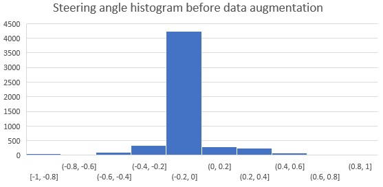
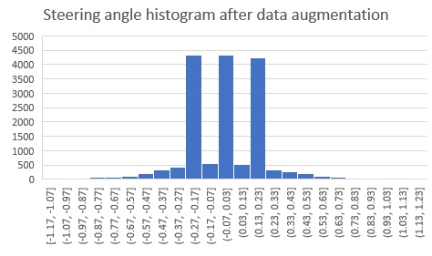

# **Behavioral Cloning** 

## Project: Build a Behavioral Cloning Network

In this project I have used Deep Convolutional Neural Network to build a behavioral cloning network that will learn the behavior of a human driver in driving a car in a test track and eventually use this learning to autonomously drive the car.

I have used the following to build this Network

1. Python 3.5
2. Keras
3. OpenCV
4. Numpy

---

## Overview of steps followed in completing this project

The goals / steps of this project are the following:
* Data Collection using the Simulator provided by Udacity
* Data Preparation by Processing the collected data and augmenting it with additional data
* Choose a pre-built model and train it on the prepared data
* Test the model on track 1 using autonomous mode
* Record the autonomous drive and prepare a video

## Final Result

The model was able to drive the car successfully on track 1 [See Test Result Video here](https://www.youtube.com/watch?v=cZ8XhD4_pKk)

## Detailed explanation of the steps followed

In this section, I will explain in detail how each of the steps mentioned in the overview are done

### Data Collection

The simulator provided by Udacity contains two modes Training mode and Autonomous mode. I have used the Training mode to collect the data by driving through the track and recording the driving data (images and driving log) in a detaination folder. This is the approach that I followed to collect the data based on the suggestions by the course instructor and from the discussions in Slack channel

1. Two laps of center lane driving clockwise
2. One lap of center lane driving counter clockwise to avoid left bias as the track has more left turns
3. One lap of recovery driving by recording the recovery from left to center and right to center

Following is a histogram of the steering angles after the data collection  



### Data Processing

Data processing is done to augment the training data with some more additional data so that the model can be generalized. The data processing is built into a generator to allow for real-time processing of the data. The advantage of using a generator is, we don't have to load all the data into memory at once and can be handled in batches. Hence the generator is run in parallel to the model for efficiency.

I have used the following techniques to augment the training data

1. Adding random shadow to the original camera images
2. Adding random brightness to the originla camera images
3. Flipping the original camera images

Steering angle correction has been used for the left and right camera images. I have tried various correction angles between 0.1 to 0.25 and has settled with a steering correction of 0.17 which is working for my training data.

In addition to the above steps I have also cropped the image to only include a region of interest and normalized the data so that it has zero mean and equal variance.

Here is how the histogram of the steering anlgles after data processing



As we can see from the histogram now that the probability of left and right steering angles is also boosted equally to straight steering 
angle.


[//]: # (Image References)

[image1]: ./examples/placeholder.png "Model Visualization"
[image2]: ./examples/placeholder.png "Grayscaling"
[image3]: ./examples/placeholder_small.png "Recovery Image"
[image4]: ./examples/placeholder_small.png "Recovery Image"
[image5]: ./examples/placeholder_small.png "Recovery Image"
[image6]: ./examples/placeholder_small.png "Normal Image"
[image7]: ./examples/placeholder_small.png "Flipped Image"

## Rubric Points
###Here I will consider the [rubric points](https://review.udacity.com/#!/rubrics/432/view) individually and describe how I addressed each point in my implementation.  

---
###Files Submitted & Code Quality

####1. Submission includes all required files and can be used to run the simulator in autonomous mode

My project includes the following files:
* model.py containing the script to create and train the model
* drive.py for driving the car in autonomous mode
* model.h5 containing a trained convolution neural network 
* writeup_report.md or writeup_report.pdf summarizing the results

####2. Submission includes functional code
Using the Udacity provided simulator and my drive.py file, the car can be driven autonomously around the track by executing 
```sh
python drive.py model.h5
```

####3. Submission code is usable and readable

The model.py file contains the code for training and saving the convolution neural network. The file shows the pipeline I used for training and validating the model, and it contains comments to explain how the code works.

###Model Architecture and Training Strategy

####1. An appropriate model architecture has been employed

My model consists of a convolution neural network with 3x3 filter sizes and depths between 32 and 128 (model.py lines 18-24) 

The model includes RELU layers to introduce nonlinearity (code line 20), and the data is normalized in the model using a Keras lambda layer (code line 18). 

####2. Attempts to reduce overfitting in the model

The model contains dropout layers in order to reduce overfitting (model.py lines 21). 

The model was trained and validated on different data sets to ensure that the model was not overfitting (code line 10-16). The model was tested by running it through the simulator and ensuring that the vehicle could stay on the track.

####3. Model parameter tuning

The model used an adam optimizer, so the learning rate was not tuned manually (model.py line 25).

####4. Appropriate training data

Training data was chosen to keep the vehicle driving on the road. I used a combination of center lane driving, recovering from the left and right sides of the road ... 

For details about how I created the training data, see the next section. 

###Model Architecture and Training Strategy

####1. Solution Design Approach

The overall strategy for deriving a model architecture was to ...

My first step was to use a convolution neural network model similar to the ... I thought this model might be appropriate because ...

In order to gauge how well the model was working, I split my image and steering angle data into a training and validation set. I found that my first model had a low mean squared error on the training set but a high mean squared error on the validation set. This implied that the model was overfitting. 

To combat the overfitting, I modified the model so that ...

Then I ... 

The final step was to run the simulator to see how well the car was driving around track one. There were a few spots where the vehicle fell off the track... to improve the driving behavior in these cases, I ....

At the end of the process, the vehicle is able to drive autonomously around the track without leaving the road.

####2. Final Model Architecture

The final model architecture (model.py lines 18-24) consisted of a convolution neural network with the following layers and layer sizes ...

Here is a visualization of the architecture (note: visualizing the architecture is optional according to the project rubric)

![alt text][image1]

####3. Creation of the Training Set & Training Process

To capture good driving behavior, I first recorded two laps on track one using center lane driving. Here is an example image of center lane driving:

![alt text][image2]

I then recorded the vehicle recovering from the left side and right sides of the road back to center so that the vehicle would learn to .... These images show what a recovery looks like starting from ... :

![alt text][image3]
![alt text][image4]
![alt text][image5]

Then I repeated this process on track two in order to get more data points.

To augment the data sat, I also flipped images and angles thinking that this would ... For example, here is an image that has then been flipped:

![alt text][image6]
![alt text][image7]

Etc ....

After the collection process, I had X number of data points. I then preprocessed this data by ...


I finally randomly shuffled the data set and put Y% of the data into a validation set. 

I used this training data for training the model. The validation set helped determine if the model was over or under fitting. The ideal number of epochs was Z as evidenced by ... I used an adam optimizer so that manually training the learning rate wasn't necessary.
