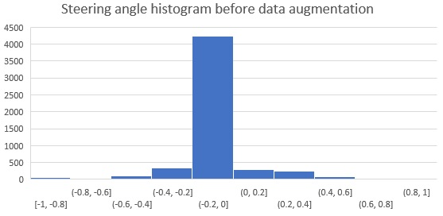
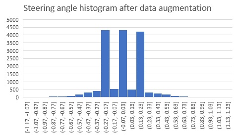
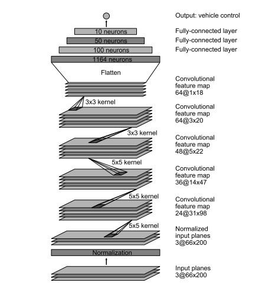

# **Behavioral Cloning** 

## Project: Build a Behavioral Cloning Network

In this project I have used Deep Convolutional Neural Network to build a behavioral cloning network that will learn the behavior of a human driver in driving a car in a test track and eventually use this learning to autonomously drive the car.

I have used the following to build this Network

1. Python 3.5
2. Keras
3. OpenCV
4. Numpy

---

## Overview of steps followed in completing this project

The goals / steps of this project are the following:
* Data Collection using the Simulator provided by Udacity
* Data Preparation by Processing the collected data and augmenting it with additional data
* Choose a pre-built model and train it on the prepared data
* Test the model on track 1 using autonomous mode

## Final Result

The model was able to drive the car successfully on track 1 [See Test Result Video here](https://www.youtube.com/watch?v=cZ8XhD4_pKk)

## Detailed explanation of the steps followed

In this section, I will explain in detail how each of the steps mentioned in the overview are done

### Data Collection

The simulator provided by Udacity contains two modes Training mode and Autonomous mode. I have used the Training mode to collect the data by driving through the track and recording the driving data (images and driving log) in a detaination folder. This is the approach that I followed to collect the data based on the suggestions by the course instructor and from the discussions in Slack channel

1. Two laps of center lane driving clockwise
2. One lap of center lane driving counter clockwise to avoid left bias as the track has more left turns
3. One lap of recovery driving by recording the recovery from left to center and right to center

Following is a histogram of the steering angles after the data collection  

### Data Processing

Data processing is done to augment the training data with some more additional data so that the model can be generalized. The data processing is built into a generator to allow for real-time processing of the data. The advantage of using a generator is, we don't have to load all the data into memory at once and can be handled in batches. Hence the generator is run in parallel to the model for efficiency.

I have used the following techniques to augment the training data

1. Adding random shadow to the original camera images
2. Adding random brightness to the originla camera images
3. Flipping the original camera images

Steering angle correction has been used for the left and right camera images. I have tried various correction angles between **0.1** to **0.25** and has settled with a steering correction of **0.17** which is working for my training data.

In addition to the above steps I have also cropped the image to only include a region of interest and normalized the data so that it has zero mean and equal variance.

Here is how the histogram of the steering anlgles after data processing

As we can see from the histogram now that the probability of left and right steering angles is also boosted equally to straight steering 
angle.

### Model Training

I have adopted [Nvidia model](https://arxiv.org/pdf/1604.07316v1.pdf) for training as it gave better results compared to Alexnet. The network consists of 9 layers, including a normalization layer, 5 convolutional layers and 3 fully connected layers. 

Image was normalized in the first layer. According to the Nvidia paper, this enables normalization also to be accelerated via GPU processing.

Convolution were used in the first three layers with 2x2 strides and a 5x5 kernel, and non-strided convolution with 3x3 kernel size in the last two convolutional layers.

The convolutional layers were followed by three fully connected layers which then outputs the steering angle.

An Adam optimizer was used for optimization. This requires little or no tunning as the learning rate is adaptive.

80% of the collected data is used for training and the remaining 20% is used for validation.

I have trained the model using 3, 5 and 7 epochs and found that the training and validation loss was not decreasing after 4 epochs. Hence used 4 epochs for the final model.

### Model Testing

The trained model has been saved using a file called model.h5 and it is used along with drive.py python program along with the simulator running in autonomous mode on track 1 to test the model. The model was able to successfully drive the car around the track and the result video can be seen [here](https://www.youtube.com/watch?v=cZ8XhD4_pKk)  
Video recording using video.py that shows the view from the camera image in the car can be seen in [video.mp4](./video.mp4) file in this repository

### Conclusion

I found that it is equally important to get a good quality of training data to train the model as choosing the model that works for this project. As this is behavioral cloning, quality training in, quality results out and garbage in, garbage out. Hence quality data collection and proper data augmentation techniques along with the best working Deep Learning model are the key factors in finishing this project.  

### External resources that I referred

I have referred the following resources in successfully completing this project

[Nvidia Paper](https://arxiv.org/pdf/1604.07316v1.pdf)  

[vivek's blog](https://chatbotslife.com/using-augmentation-to-mimic-human-driving-496b569760a9) 
